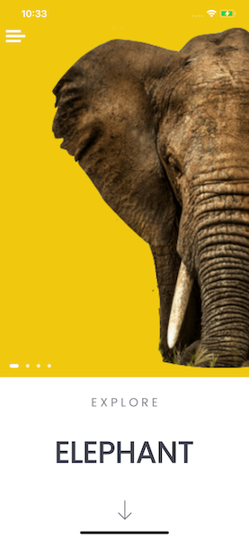
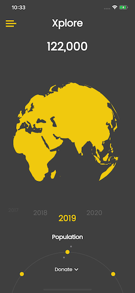
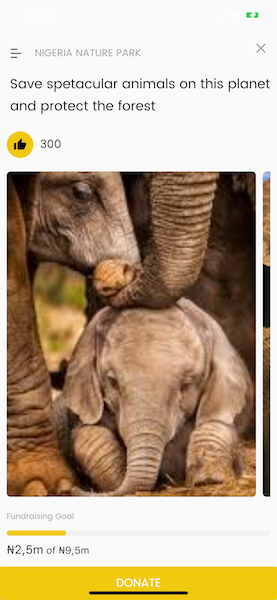

# Xplore
A mobile application designed for the exploration of Nature with wildlife in focus. Useful information regarding the status of wildlife from around the world is made available. The major purpose is to educate users on how human enabled activities tends to affect the ecosystem and what can be done to maintain and preserve these resources.To play a part from the comfort of your home, you can donate to organizations whose key responsibility is to protect wildlife. With the Xplore app you get familiar with wildlife creatures and will be able to support to protect your new found friends.

## Video Link
https://www.youtube.com/watch?v=iAhzxUtX_C8&feature=youtu.be

## APP VIEW

## ABOUT
Taking a good look at how the recent pandemic has disrupted the flow of regular activities in every individual, this is just as much similar to what wildlife species go through when human imposed actions causes a disrupt in their ecosystem. I have learnt to value life and the little things around me during this pandemic, to protect endangered species from extinction cause “you don’t know what you have till it’s gone”.

## Getting Started

This project is a starting point for a Flutter application.

A few resources to get you started if this is your first Flutter project:

- [Lab: Write your first Flutter app](https://flutter.dev/docs/get-started/codelab)
- [Cookbook: Useful Flutter samples](https://flutter.dev/docs/cookbook)

For help getting started with Flutter, view our
[online documentation](https://flutter.dev/docs), which offers tutorials,
samples, guidance on mobile development, and a full API reference.
